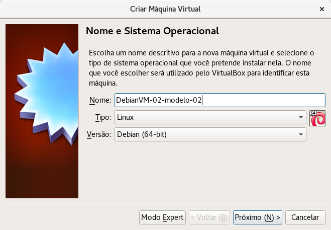
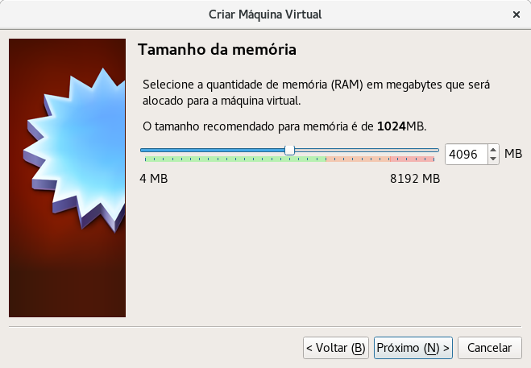

Debian 9 - Strech
=================

_Versão 1 - atualizada em 11/07/2017_

-----

# Objetivo

Este tutorial objetiva demonstrar a instalação e configuração do sistema operacional _Debian9 - Strech_ com um ambiente gráfico enxuto, ou seja, apenas com programas básicos ocupando o mínimo de recursos do computador. Tal instalação pode ser personalizada de acordo com as necessidades do usuário.

# Preparação do ambiente no _VirtualBox_

Para este exemplo de instalação e configuração de um sistema operacional _Debian9_ foi criada uma máquina virtual utilizado o software de virtualização _VirtualBox_ com as seguintes especificações:  

## Descrição e Tipo

+ **Nome:** DebianVM-02-modelo-02
+ **Tipo:** Linux
+ **Versão:** Debian (64-bit)

!!! note "Nota"
    O _VirtualBox_ possui a funcionalidade de criação de clones das máquinas virtuais. Essa funcionalidade é especialmente adequada para situações em que se planeja utilizar o mesmo sistema operacional para configurar ambientes com diversas finalidades, por exemplo: ambiente de programação em PHP, ambiente de programação em Java, ambiente de edição de imagens, ambiente de teste de redes ou qualquer outro ambiente. Basta clonar uma máquina virtual com uma instalação básica do sistema operacional que pretende utilizar e posteriormente configurá-lo de acordo com as necessidades do ambiente desejado.
    Este tipo de abordagem evita o acumulo de programas instalados no sistema operacional, tornando-o mais eficiente em termos de utilização de recursos, ademais é possível manter muitas máquinas virtuais em um computador.

Após instalação básica do _Debian9_ a máquina virtual foi clonada, para que permaneça como modelo para outras personalizações de ambiente.

## Hardware

+ Foram disponibilizados até 4GB de Memória RAM

+ Foi criado um disco virtual com até 40GB de espaço de armazenamento

+ Foram disponibilizados 2 Processadores(CPUs)

+ A memória dedicada a vídeo foi configurada para 128MB e a Aceleração 3D foi habilitada

+ A imagem de instalação do Debian9 foi carregada

+ Foi definida a utilização de uma placa de rede em modo Bridge

O restante das opções do da máquina foram mantidas como padrão do _VirtualBox_.

# Instalação Básica

+ Foi escolhida a opção de instalação em modo texto

+ Foi escolhido o idioma de instalação **Português do Brasil**

+ Foi escolhido o país **Brasil**

+ Foi escolhido o layout de teclado **Português do Brasil**

+ Foi definido o nome de máquina **DebianVM-02-modelo-02**

!!! note "Nota"
    Posteriormente o nome de máquina foi alterado na máquina clonada.

+ Foi definido o nome de domínio **local**

+ A senha do super-usuário, **root**, foi deixada em branco

!!! note "Nota"
    A senha de super-usuário foi deixada em branco propositalmente para que o comando sudo seja configurado automaticamente durante a instalação.

# Clone

# Pós clone

+ Connfiguração
