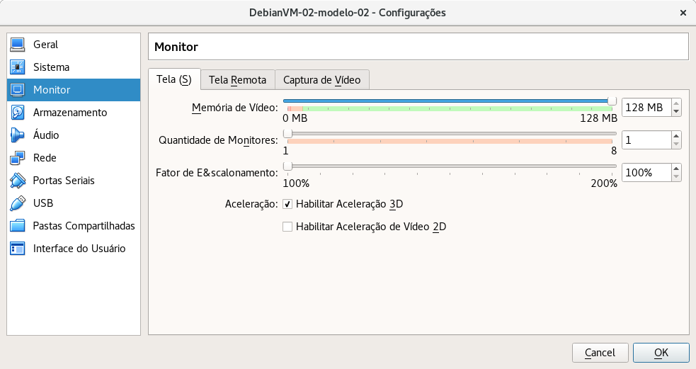
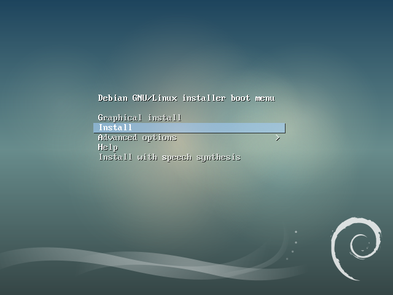
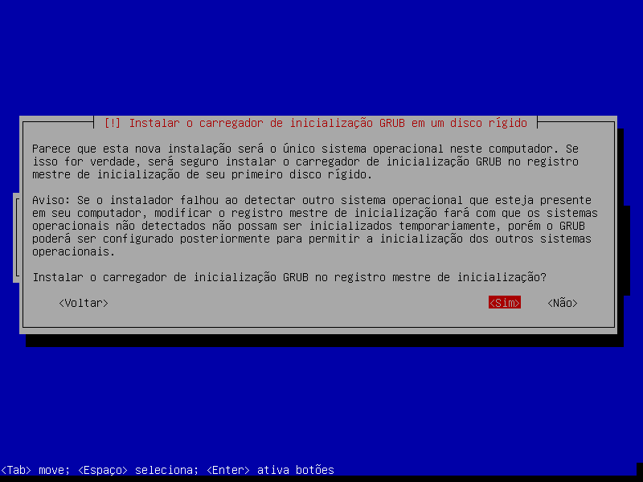

Debian 9 - Strech
=================

_Versão 1 - atualizada em 25/07/2017_

-----

# Objetivo

Este tutorial objetiva demonstrar a instalação e configuração do sistema operacional _Debian9 - Strech_ com um ambiente gráfico enxuto, ou seja, apenas com programas básicos ocupando o mínimo de recursos do computador. Tal instalação pode ser personalizada de acordo com as necessidades do usuário.

# Preparação do ambiente no _VirtualBox_

Para este exemplo de instalação e configuração de um sistema operacional _Debian9_ foi criada uma máquina virtual utilizado o software de virtualização _VirtualBox_ com as seguintes especificações:  

## Descrição e Tipo

+ **Nome:** DebianVM-02-modelo-02
+ **Tipo:** Linux
+ **Versão:** Debian (64-bit)


!!! note "Nota"

    Após instalação básica do _Debian9_ a máquina virtual foi clonada, para que permaneça como modelo para outras personalizações de ambiente.

    O _VirtualBox_ possui a funcionalidade de criação de clones das máquinas virtuais. Essa funcionalidade é especialmente adequada para situações em que se planeja utilizar o mesmo sistema operacional para configurar ambientes com diversas finalidades, por exemplo: ambiente de programação em PHP, ambiente de programação em Java, ambiente de edição de imagens, ambiente de teste de redes ou qualquer outro ambiente. Basta clonar uma máquina virtual com uma instalação básica do sistema operacional que pretende utilizar e posteriormente configurá-lo de acordo com as necessidades do ambiente desejado.

    Este tipo de abordagem evita o acumulo de programas instalados no sistema operacional, tornando-o mais eficiente em termos de utilização de recursos, ademais é possível manter muitas máquinas virtuais em um computador.

## Hardware

Foram disponibilizados até 4GB de Memória RAM.


Foi criado um disco virtual com até 40GB de espaço de armazenamento.


Foram disponibilizados 2 Processadores(CPUs).


A memória dedicada a vídeo foi configurada para 128MB e a Aceleração 3D foi habilitada.



A imagem de instalação do Debian9 foi carregada.


Foi definida a utilização de uma placa de rede em modo Bridge, deste modo trafego de rede é direcionado para a placa de rede da maquina virtual normalmente pois essa pode participar da rede física normalmente.


O restante das opções do da máquina foram mantidas como padrão do _VirtualBox_.

# Instalação Básica

Foi escolhida a opção de instalação em modo texto.



Foi escolhido o idioma de instalação **Português do Brasil**.


Foi escolhido o país **Brasil**.

.

Foi escolhido o layout de teclado **Português do Brasil**.


Foi definido o nome de máquina **DebianVM-02-modelo-02**.


!!! note "Nota"
    Posteriormente o nome de máquina foi alterado na máquina clonada.

Foi definido o nome de domínio **local**.


A senha do super-usuário, **root**, foi deixada em branco.


!!! note "Nota"
    A senha de super-usuário foi deixada em branco propositalmente para que o comando sudo seja configurado automaticamente durante a instalação.

Foi preenchido o nome completo, para exibição em determinadas partes do sistema, uma conta de usuário comum. Este usuário pode exercer os privilégios de super-usuário com o comando `sudo`.


Depois foi definido o nome de usuário para login no sistema.


E por fim foi definida a senha da conta do usuário.


Para configurar o relógio da máquina e o Fuzo Horário do sistema foi definido o estado de São Paulo como local de moradia.


O particionamento do disco pode ser realizado de "n" maneiras, entretanto, neste caso foi aceito que o sistema definisse automaticamente o esquema de partições. Caso existisse um motivo especial para se optar por exemplo para montar diretórios específicos de armazenamento de dados e partições separadas, a melhor opção nesta etapa seria o particionamento manual.


Os pacote que por ventura são selecionados mas não estão na mídia de instalação são obtidos conexão com um espelho de rede do _Debian9_, portanto, não foi necessário inserir outro CD/DVD.


Foram configurados no momento da instalação os espelhos de rede do _Debian9_ localizados no Brasil.


Não foi preciso configurar um _proxy_ pois havia uma conexão direta.


Para não alongar muito a instalação, foi rejeitada a participação no concurso de utilização de pacotes.


Nenhuma interface gráfica foi instalada neste momento pois o objetivo era obter uma instalação enxuta do sistema para que posteriormente fosse personalizado.


Por fim foi instalado o gerenciador de Boot no registro mestre de inicialização do disco principal.




# Clone

Foi feito um clone completo da máquina virtual já com o _Debian9_ instalado e o nome da máquina foi definido como `DebianVM-02`. O objetivo deste ponto em diante é personalizar o sistema operacional de acordo com a necessidade especifica. Se por ventura algo der errado com a personalização basta excluir a máquina clonada e clonar a partir do modelo novamente.


# Pós clone

## Configurações de Rede

Depois que o clone foi feito a máquina virtual poderia ser configurada para atender diversos propósitos, mas antes de qualquer coisa o nome de _host_ foi alterado logo após o do primeiro login de **DebianVM-02-modelo-02** para **DebianVM-02**.

```bash
$ sudo su
$ echo DebianVM-02 > /etc/hostname
$ exit
```
O resultado foi verificado na saída do comando `cat`.

```bash
$ cat /etc/hostname
```

```
DebianVM-02
```

O arquivo `/etc/hosts` também foi editado para referenciar corretamente o nome de _host_.

```bash
$ sudo vim /etc/hostname
```

Todas as ocorrências de **DebianVM-02-modelo-02** foram alteradas para **DebianVM-02**. O resultado foi verificado na saída do comando `cat`.

```bash
$ cat /etc/hosts
```

```
...
```

Para concluir o ajuste no nome de _host_ o sistema foi reiniciado.

```bash
$ sudo init 6
```

As configurações de IP, Mascara de Rede e Servidores DNS foram obtidas automaticamente por DHCP.

## Configuração dos Repositórios

Foram feitos ajustes no arquivo de apontamento dos espelhos de rede, `/etc/apt/sources.list`, para permitir a instalação de pacotes a partir de repositórios _Debian9_ distribuídos pela comunidade de contribuintes do projeto e também dos repositórios de software não livre. Antes de editar foi feita uma cópia do arquivo original.

```bash
$ sudo cp /etc/apt/sources.list /etc/apt/sources.list.original
$ sudo vi /etc/apt/sources.list
```

A linha que aponta para o CD/DVD de instalação como fonte foi comentada e ao final de cada uma das linhas que apontavam para um espelho de rede foram adicionadas as palavras `contrib` e `non-free`.

O resultado foi verificado na saída do comando `cat`.

```bash
$ cat /etc/apt/sources.list
```

```
...
```

Após a edição do arquivo de apontamento dos espelhos de rede foram executados os comandos para atulização da base de dados de pacotes de software disponíveis e em seguida para atualização do Sistema Operacional.

```bash
$ sudo apt update
$ sudo apt upgrade
```

## Drivers do processador

```bash
$ sudo apt install intel-microcode
```

### Editor de texto

Foi instalado o editor de textos **VIM** que não faz parte da instalação padrão do _Debian9_, que traz apenas o **VI** e o **Nano**, ambos com menos recursos de edição que o editor **VIM**.

```bash
$ sudo apt install vim
```

Para tornar o **VIM** o editor padrão do Sistema Operacional foi executado o comando `update-alternatives` e em seguida a opção referente ao **VIM** foi escolhida.

```bash
$ update-alternatives --config editor
```

Também foi editado o arquivo `/etc/vim/vimrc` para configurar o VIM fazendo-o exibir o número das linhas dos aquivos.

```bash
$ sudo vim /etc/vim/vimrc
```

Foram adicionadas duas linhas no final do arquivo.

```
" Line number
set number
```

### HTOP

Foi instalado o utilitário de monitoramento dos processos do sistema **HTOP**.

```bash
$ sudo apt install htop
```

!!! note "Desempenho da máquina"

    O **HTOP** pode ser executado através da linha de comando com o comando `htop`.

    Não era necessário instalar o **HTOP** neste momento, todavia é interessante observar o desempenho da máquina antes de continuar com a instalação do restante dos softwares, e seguir observando a cada nova instalação a mudança no consumo dos recursos de memória e processamento.

### Shell

Foram feitos ajustes no arquivo `/etc/profile` para que o comando `history` exiba a data e o horário que cada comando executado, além do número de identificação e obviamente o comando.

```bash
$ sudo vim /etc/profile
```

Foram adicionadas quatro linhas no final do aquivo.

```
# Historico
export HISTSIZE=5000
export HISTFILESIZE=10000
export HISTTIMEFORMAT="%F %T "
```

### Opções de idioma

Com o comando `dpkg-reconfigure` foram adicionados os idiomas Português e Inglês com as variações de caracteres UTF-8 e ISO-8859-1.

```bash
$ sudo dpkg-reconfigure locales
```

No utilitário foram marcadas as opções:

```
en_US.ISO-8859-1
en_US.UTF-8
pt_BR.ISO-8859-1
pt_BR.UTF-8
```

O resultado foi verificado com o comando `locale`.

```bash
$ locale -a
```

```
C
C.UTF-8
en_US
en_US.iso88591
en_US.utf8
POSIX
pt_BR
pt_BR.iso88591
pt_BR.utf8
```

## Interface Gráfica XFCE 4

Foi isntalado a interface gráfica _XFCE 4_. O _XFCE_ é conhecido por ser um ambiente leve, o que procpcia melhor desempenho da máquina além de permitir que os recursos de processamento e memória sejam utilizados pelos aplicativos de usuário final e não pelo sistema operacional em si.

```bash
$ sudo apt install xfce4
```

## Terminal gráfico

O _XFCE 4_ possui vários aplicativos que são padrão do ambiente, entre eles um terminal gráfico, o _xfce4-terminal_, contudo ele não foi isntalado no passo anterior, por isso foi instalado separadamente.

```bash
$ sudo apt install xfce4-terminal
```

Após a instalação do terminal-gráfico o sistema foi reiniciado. Ao ser reiniciado já carregou a interface gráfica _XFCE 4_.

## Drivers do _Virtualbox_

Foram instalados os pacotes adicionais de software do _Virtualbox_, o principal problema que estes pacotes resolvem é o fato que após instalado no _Virtualbox_ o Debian e vários outros S.O. não reconhecem as dimensões do monitor e portanto executam o vídeo em uma proporção 4:3 comum. Com a instalação dos pacotes adicionais é possível mudar a resolução de vídeo para uma que seja 19:9 _widescreen_.
Antes de iniciar a instalação dos adicionais para convidado, foram instaladas as dependencias.

```bash
$ sudo apt install linux-headers-amd64
$ sudo apt build-dep -y linux
```

Utilizando os controles da janela do _Virtualbox_ o disco com a instalação dos pacotes adicionais foi montado.

```
Dispositivos > Inserir imagem do CD dos adicionais para convidado
```

Agora no terminal gráfico do _XFCE_ o disco foi montado em `/media/cdrom`.

```bash
$ sudo mount -t iso 9660 /dev/sr0 /media/cdrom
$ cd /media/cdrom
$ sudo sh ./VBoxLinuxAdditions.run

```

!!! note "Nota"
    A instalação dos pacotes adicionais deve ser feita apenas se a instalação do _Debian9_ foi realizada em máquina virtual com o _Virtualbox_.

Após a instalação dos adicionais de convidado o sistema foi reiniciado.

```bash
$ sudo init 6
```

## Aplicativos comuns

Foram instalados os seguintes Aplicativos para completar a experiêcia de uso do Sistema Operacional:

+ **network-manager network-manager-gnome:** Gerenciadores de conexão de rede.
+ **xserver-xorg-input-synaptics:** Controle para aplicar funcionalidades ao _touchpad_ do mouse de notebooks.
+ **gksu synaptic apt-xapian-index policykit-1-gnome:** Aplicacativos para instalação de pacotes via interface gráfica.
+ **xfce4-clipman xfce4-power-manager xfce4-screenshooter xfce4-taskmanager xfce4-xkb-plugin ristretto rsync:** Aplicativos da interface e ambiente do _XFCE4_.
+ **xfce4-whiskermenu-plugin:** Menu de aplicativos _user friendly_ (amigável).
+ **leafpad:** Editor de texto puro.
+ **xarchiver thunar-archive-plugin p7zip unzip p7zip-full:** utilitários para compactação em descompactação de arquivos.
+ **fonts-dejavu fonts-dejavu-extra fonts-droid-fallback fonts-freefont-ttf fonts-liberation fonts-noto-mono fonts-opensymbol ttf-bitstream-vera ttf-dejavu ttf-dejavu-core ttf-dejavu-extra ttf-freefont ttf-liberation ttf-mscorefonts-installer:** Pacotes de fontes, tipográfia, para sistema operacional.
+ **aspell aspell-pt-br hunspell hunspell-pt-br:** Correção ortográfica.
+ **firefox-esr firefox-esr-l10n-pt-br chromium chromium-l10n chromium-widevine:** Navegadores web.

```bash
$ sudo apt install network-manager network-manager-gnome
$ sudo apt install xserver-xorg-input-synaptics
$ sudo apt install gksu synaptic apt-xapian-index policykit-1-gnome
$ sudo apt install xfce4-clipman xfce4-power-manager xfce4-screenshooter xfce4-taskmanager xfce4-xkb-plugin ristretto rsync
$ sudo apt install xfce4-whiskermenu-plugin
$ sudo apt install leafpad
$ sudo apt install xarchiver thunar-archive-plugin p7zip p7zip-full unzip
$ sudo apt install fonts-dejavu fonts-dejavu-extra fonts-droid-fallback fonts-freefont-ttf fonts-liberation fonts-noto-mono fonts-opensymbol fots-stix ttf-bitstream-vera ttf-dejavu ttf-dejavu-core ttf-dejavu-extra ttf-freefont ttf-liberation ttf-mscorefonts-installer
$ sudo apt install aspell aspell-pt-br hunspell hunspell-pt-br
$ sudo apt install firefox-esr firefox-esr-l10n-pt-br chromium chromium-l10n chromium-widevine
```

!!! note "Nota"
	
	Após a instalação dos aplicativos para completar a experiencia de uso, o sistema pode ser utilizado para diversas funções. Quaisquer outras personalizações ficam a critério do usuário. O básico está completo.

## Firewall

Foi configuarado um firewall para implementar um pouco mais de segurança ao sistema.

```bash
$ sudo apt install ufw gufw
```

Após instalado o firewall foi configurado para impedir qualquer tentativa de conexão de entrada e permitir todas as conexões de saída.

```bash
sudo ufw status
sudo ufw default deny incoming
sudo ufw default allow outgoing
sudo ufw status verbose
```

!!! note "Nota"
	
	O **gufw** é uma interface gráfica para gerenciamento do Firewall.